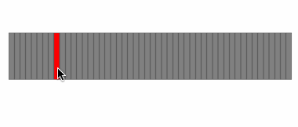

SlotPickerView
===

A highly customisable picker view for selecting multiple ranges. 

Demo
----



Install
----

Add this repo to your swift package manager:

```
https://github.com/cemolcay/SlotPickerView.git
```

Usage
----

- Put your slider/picker view inside the `SlotPickerView`. 
- Set the slot item count.
- Set the delegate.

``` swift
let slotPicker = SlotPickerView()
let slotDisplay = UIStackView()
view.addSubview(slotPicker)
slotPicker.addSubview(slotDisplay)
slotPicker.slotCount = 50
slotPicker.delegate = self
```

- Implement the delegate method. 

``` swift
func slotPickerViewDidPickSlot(_ slotPickerView: SlotPickerView) {
    slotDisplay.arrangedSubviews.forEach({ $0.backgroundColor = .gray })
    for slot in slotPickerView.pickedSlots {
        for i in slot.startIndex...slot.endIndex {
            slotDisplay.arrangedSubviews[i].backgroundColor = .red
        }
    }
}
```

You can update your picker display with the `SlotPickerView`s `pickedSlots` property in the delegate method. 

### SlotItemData

Represents the picked slots in the picker. Has the `startIndex`, `endIndex` and `length` properties. 
 
